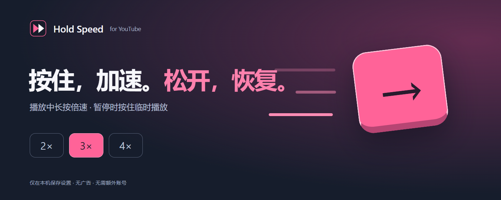
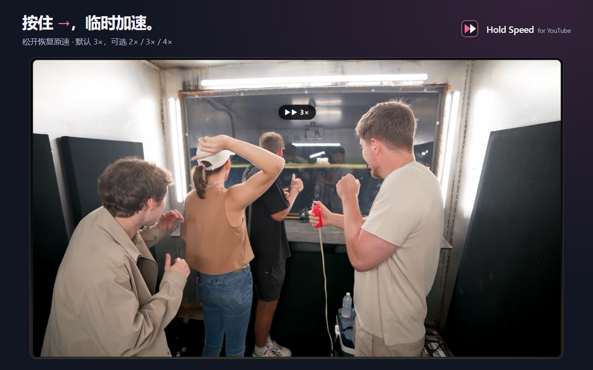
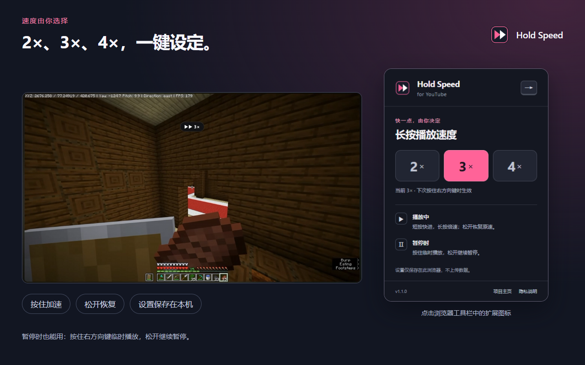
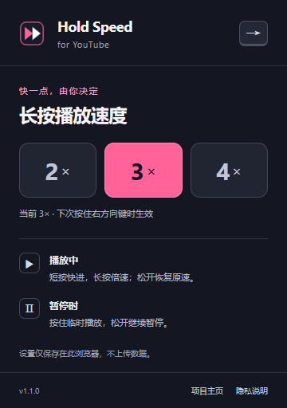

  

<h1 align="center">Hold Speed for YouTube</h1>

  把熟悉的「长按右方向键倍速」带到 YouTube。 
  按住加速，松开恢复，支持 <strong>2× / 3× / 4×</strong>。

  <a href="https://chromewebstore.google.com/detail/hhooohnajochajnlmhembkjhpkkcdbmg">从 Chrome 商店安装</a> ·
  <a href="https://github.com/Vaelitte/youtube-hold-speed/releases/latest">下载安装包</a> ·
  <a href="#安装与设置">安装与设置</a> ·
  <a href="PRIVACY.md">隐私说明</a> ·
  <a href="store/README.md">全部展示素材</a> ·
  <a href="https://github.com/Vaelitte/youtube-hold-speed/issues">反馈问题</a>

轻量 Chrome Manifest V3 扩展，无运行时依赖、无需构建。倍速设置仅保存在本机，无广告、无统计分析。

> **商店进度 · 2026-10-01 核实**：v1.1.0 已通过审核并公开发布，可以[从 Chrome 应用商店安装](https://chromewebstore.google.com/detail/hhooohnajochajnlmhembkjhpkkcdbmg)。GitHub 的 v1.1.1 修正了账号更名后的链接；商店更新进度见[提交记录](store/SUBMISSION.md)。

## 功能预览

### 播放中：短按快进，长按加速

按住 `→` 约 300 毫秒，视频进入所选倍速，播放器显示速度提示。松开后恢复原来的速度，包括 0.5×、1.5×、2× 等；短按仍在松开时触发 YouTube 原有的快进。

### 暂停时：按住播放，松开暂停

暂停的视频按下 `→` 后立即临时播放，松开后继续暂停，停在新位置。点击工具栏扩展图标即可选择 **2× / 3× / 4×**，默认 **3×**，下次按住时生效。

两张展示图使用用户提供的 YouTube 实测画面；第二张同时展示 v1.1.0 的实际设置弹窗。[查看原图与素材说明](store/README.md)

## 使用方式

| 操作 | 效果 |
| --- | --- |
| 播放时长按 `→` | 约 300 毫秒后临时加速，松开恢复此前速度 |
| 播放时短按 `→` | 松开时触发 YouTube 原有快进，通常为 5 秒 |
| 暂停时按下 `→` | 立即按所选倍速临时播放，松开恢复暂停 |
| 点击扩展图标 | 选择 2× / 3× / 4×，仅在当前浏览器保存 |
| `←`、`↑`、`↓` | 保留 YouTube 原有后退和音量操作 |
| `Ctrl / Alt / Shift / ⌘` + 方向键 | 保留原有组合快捷键 |
| 搜索框、评论框、播放器菜单中的方向键 | 保留原有编辑或导航操作 |

长按从原位置继续播放，不会先跳过 5 秒。三档速度均为绝对播放速度，不会在当前速度上再乘倍数。**暂停时的短按也采用「按下播放、松开暂停」规则**，不再跳过 5 秒。

## 安装与设置

可直接[从 Chrome 应用商店安装](https://chromewebstore.google.com/detail/hhooohnajochajnlmhembkjhpkkcdbmg)。如需使用 GitHub 安装包或源码，可按以下步骤手动加载：

1. 在 [Releases](https://github.com/Vaelitte/youtube-hold-speed/releases/latest) 下载 `youtube-hold-speed-v1.1.1.zip` 并解压。
2. 在 Chrome 地址栏输入 `chrome://extensions`，打开右上角的**开发者模式**。
3. 点击**加载已解压的扩展程序**，选择解压后直接包含 `manifest.json` 的目录。
4. 刷新已打开的 YouTube 页面，在浏览器扩展菜单中固定 **Hold Speed**。
5. 点击扩展图标选择速度，回到视频按住右方向键体验。

如果克隆仓库或下载的是源码 ZIP，第 3 步应选择项目中的 **`extension` 文件夹**。安装后请保留所加载的目录；更新时点击扩展管理页面的重新加载按钮，再刷新 YouTube 标签页。可参考 [Chrome 官方本地安装说明](https://developer.chrome.com/docs/extensions/get-started/tutorial/hello-world#load-unpacked)。

查看实际的倍速设置弹窗

  

选择会立即保存在本机，下一次按住右方向键时生效，无需刷新当前视频。关闭并重新打开弹窗后仍会保留设置。

## 兼容范围与隐私

- 适用于桌面版 Chrome 的 `www.youtube.com` 页面，以及 `www.youtube-nocookie.com/embed/` 中的匹配播放器。键盘焦点需处于相应页面或播放器中。
- 失焦、切换标签页、切换视频或广告开始时会退出临时加速。广告和时长无限的直播不启用此功能。
- 仅通过 `chrome.storage.local` 保存一个倍速偏好，不上传浏览、播放或按键数据。具体处理范围见 [隐私说明](PRIVACY.md)。
- YouTube 的播放器及快捷键实现变更，或同时使用其他键盘、倍速扩展，可能影响兼容性。[遇到问题可在这里反馈](https://github.com/Vaelitte/youtube-hold-speed/issues)。

本项目为独立第三方扩展，与 YouTube、Google、Bilibili 无官方关联。

## 开发与资料

- [开发、实现细节与手动验收](docs/DEVELOPMENT.md)
- [验证记录](docs/VALIDATION.md) · [GitHub Actions](https://github.com/Vaelitte/youtube-hold-speed/actions)
- [图标、截图与宣传图素材页](store/README.md)
- [商店提交记录与填写说明](store/SUBMISSION.md)
- [更新日志](CHANGELOG.md)

## English

Choose **2×, 3× or 4×** in the toolbar popup (default: 3×). While playing, hold **ArrowRight** for 300 ms to accelerate and release to restore the previous rate; a quick tap replays YouTube's normal seek on release. While paused, pressing ArrowRight starts temporary playback immediately and releasing pauses again. Other arrows, modified shortcuts and text input keep their native behavior. Ads and infinite-duration live streams are excluded.

Install from the [Chrome Web Store](https://chromewebstore.google.com/detail/hhooohnajochajnlmhembkjhpkkcdbmg), or download the extension ZIP from [Releases](https://github.com/Vaelitte/youtube-hold-speed/releases/latest), extract it, then load the folder containing `manifest.json` at `chrome://extensions` with Developer mode enabled. When using the source repository, load the `extension/` directory instead. Refresh YouTube after installation. The popup is currently in Simplified Chinese. Only the speed preference is stored locally; no extra account is required.

See the [visual asset gallery](store/README.md), [development guide](docs/DEVELOPMENT.md) and [validation record](docs/VALIDATION.md) for more details.

## License

[MIT](LICENSE). 视频截图内容的权利归其各自权利人；素材来源见 [素材说明](store/README.md#来源与再生成)。
