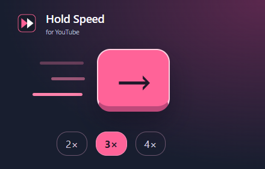

# Hold Speed 展示素材

[返回项目首页](../README.md) · [商店提交记录](SUBMISSION.md) · [下载素材包](https://github.com/J1Guang/youtube-hold-speed/releases/tag/v1.1.0)

这里集中展示项目首页与 Chrome 应用商店使用的六张成品图。点击预览可打开原尺寸文件；在文件页选择下载即可保存 PNG。Releases 中的 `youtube-hold-speed-store-kit-v1.1.0.zip` 包含整套提交素材。

## 首页封面与顶部宣传图

1400 × 560，用于项目首页封面与商店顶部宣传位置。

## 功能截图

### 播放中的临时加速

1280 × 800，展示用户提供的 YouTube 视频画面及 3× 倍速提示。

### 三档速度设置

1280 × 800，组合用户提供的游戏视频画面与 v1.1.0 的实际设置弹窗。

## 图标与小型宣传图

| 商店图标 · 128 × 128 | 小型宣传图 · 440 × 280 |
| --- | --- |
|  |  |

图标带透明边距；小型宣传图和两张功能截图均为无透明层 PNG。

## 实际设置弹窗

360 × 512，直接从扩展界面截图，默认选中 3×。用于文档中的界面预览，不作为独立的商店截图上传。

## 文件索引

| 文件 | 尺寸 | 用途 |
| --- | --- | --- |
| [icon-128.png](assets/icon-128.png) | 128 × 128 | 商店图标、README 标识 |
| [promo-marquee-1400x560.png](assets/promo-marquee-1400x560.png) | 1400 × 560 | README 封面、商店顶部宣传图 |
| [screenshot-01-playback-1280x800.png](assets/screenshot-01-playback-1280x800.png) | 1280 × 800 | 播放功能演示 |
| [screenshot-02-settings-1280x800.png](assets/screenshot-02-settings-1280x800.png) | 1280 × 800 | 速度设置演示 |
| [promo-small-440x280.png](assets/promo-small-440x280.png) | 440 × 280 | 商店小型宣传图、项目分享 |
| [popup-preview.png](assets/popup-preview.png) | 360 × 512 | 实际设置界面预览 |

## 来源与再生成

- [原创图标源文件](icon.svg)：扩展和商店图标的矢量源文件；[扩展图标目录](../extension/icons/) 包含 16、32、48、128 像素版本。
- 原始实测画面：[视频截图](reference/playback-demo.png)、[游戏截图](reference/game-demo.png)。由用户提供，用于展示原版 3× 倍速功能，视频画面保持原样。
- 设置弹窗：从实际 v1.1.0 扩展界面截图。宣传排版、背景和按键图形由 [生成脚本](../scripts/render-store.mjs) 绘制。
- 再生成：安装开发依赖及浏览器后，在仓库根目录运行 `npm run store:assets`；本机 Chrome 的配置方式见 [开发说明](../docs/DEVELOPMENT.md)。

视频画面的内容权利归其各自权利人，不纳入本项目原创代码的 MIT 授权声明。界面展示图不替代功能验收，测试范围与结果见 [验证记录](../docs/VALIDATION.md)。

商店文案：[中文介绍](description.zh-CN.txt)、[英文介绍](description.en.txt)、[隐私与权限字段](privacy-fields.zh-CN.txt)、[结构化资料](listing.json)。
